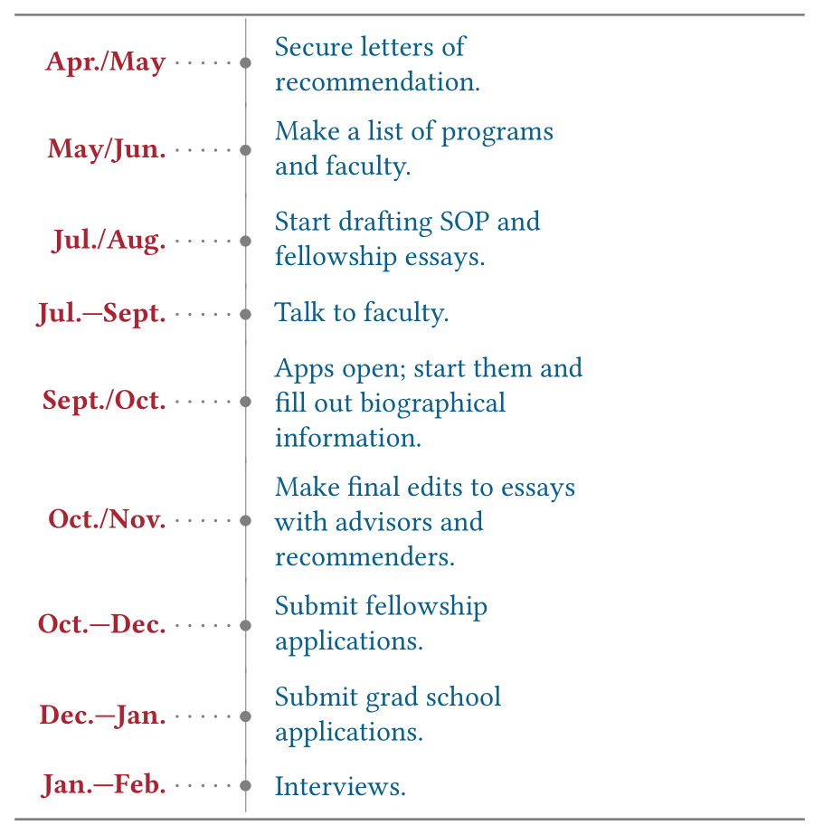

# Applying to STEM Ph.D. Programs

## George Iskander

**Grad Folder**: [(Click here!)](https://drive.google.com/drive/folders/1vI2JCuJCNmggk-SFkw5LnA046zGItzvM?usp=sharing)

**Email:** <george.iskander@yale.edu>

**If you want to see my CV and SOP, feel free to email me.**

What is this guide?
===================

This is a guide on how to apply to graduate school and fellowships. My
philosophy in this guide is to give you the tools and knowledge you need
to create a strong app. In the end, I will link to some great guides you
may have heard of (Prof. Guo's for example). But my focus is different.
Guo, for instance, emphasizes the role of research in the evaluation of
your SOP and tells you what's important, but he does not tell you *how*
to craft a strong app. I hope I can give some pointers!

Caveat: I write for my experience in physics, and this advice will
largely transfer to other STEM fields, with some exceptions. In
mathematics, undergraduate research is difficult to conduct, and less
emphasis is placed on the research a student has conducted, for
instance.

About Me (and why this guide?)
==============================

My name is George, and I am a current senior. I will be entering a PhD
program in physics this fall. I'm passionate about physics as well as
about outreach in STEM. Along my journey, I've been helped by amazing
mentors, and the only reason I am where I am is because of them and
their generosity. I wrote this guide because, in my opinion, graduate
admissions is much more opaque compared to undergraduate admissions, and
I believe this guide might be helpful to current juniors thinking about
applying.

For instance, there's typically many factors that are beyond your
control in graduate admissions. Strong candidates get rejected all the
time, even if they were a good fit for the program and the faculty. Why?
Maybe a person didn't get in because all the faculty they want to work
with aren't taking students. Or because they didn't talk to faculty, and
some other student did talk to the faculty. And this is what makes the
process opaque. People will tell you to talk to faculty, make
connections, sure, but I find this advice sort of vague.

So, my goal with this document is to cut through the cruft and distill
the most important advice I've gotten. I want you to know what the
process is like and how to optimize your chances. I know that the idea
of having a non-insignificant part of your career in someone else's
hands is really frustrating, especially when you know you're being
judged by metrics that you may find unfair (such as the GRE and GRE
subject tests). So, I spent months thinking about how to improve my
application. In retrospect, I realize there is only so much you can do,
but there are some important things you can and should do. I got
rejected from a lot of schools, but I got into many other programs that
I'm excited about!

At the end of the day, it is a crapshoot. You will get in somewhere,
absolutely. The question is just where. I hope with this guide in hand,
you are more informed about the process and can craft the
strongest application you can. At the top of this guide, you will find a
link to a Google Drive folder that has a lot of resources as well as a
Google Sheet that will help you track your app (I call it simply the
"grad sheet" in this document).

I've also put my email at the beginning of the document. Do not hesitate
to email me if you have any questions and need any help. I want to make
admissions equitable, and I believe the best way to do so is to make
myself as available as possible.

One last thing before I dive in: your mileage may and will vary. This is
advice I've heard and what I've seen in my experience. This is not an
atlas, but rather, a survey of the landscape. Take from it what helps,
and if you feel like some advice is inapplicable, then trust yourself
and your common sense. Again, if you need any advice relevant to your
situation, feel free to email me.

The Question of GPA
===================

I need to dispel this from the outset. I've had a lot of people ask me
if they can get into grad school with anything other than a 4.0. I want
to say that when it comes to reading your application, GPA is far from
the most important thing in your application. Grad schools care first
and foremost about your ability to be a capable researcher. GPA does not
reflect your ability to do research. That is not to say it's not
important. I will say that once you're over a certain GPA, it doesn't
really matter what the exact number is. This number depends on the
school, but once you're past this hurdle, your GPA is not going to be
the reason you've been rejected (if you get rejected). So, if you are
set on going to graduate school, give it a shot, and don't worry about
your GPA.

Tips for Freshmen/Sophomores
============================

Comments
--------

If you find this document and you're a freshman or sophomore, you might
be considering going to grad school, and you're worried about what to do
now to ensure you have a strong application later. This is definitely
something to think about and take action on, but it is not something to
stress about. Getting into grad school is predicated on being a good
student and doing well in research and to a certain extent, your
classes! So here's the advice I will give you:

Advice
------

1.  Do well in your classes and go to office hours. At the beginning, I
    mentioned GPA is not the most important part of the application.
    This is still true, but all things equal, you want to ensure
    you do the best you can in your major classes. If you've had a bad
    semester, it's not the end. I had a very tough time in my
    first three semesters, and demonstrated an upward trend after that
    in my application. Showing an upward trend demonstrates to the
    admissions committee your tenacity and your ability to do well.

    Go to office hours as well, for any reason: if you have questions
    about the material, think the professor's cool, or you just want
    to make a connection. Once it comes time to ask for recommendation
    letters, having this connection with your recommenders will be very
    beneficial.

2.  Get involved in research, whether on campus or at external programs.
    I could write another document just on this topic, but I've written
    some FAQs on this subject so I'll link them here:

    1.  [Research Guides/FAQ (click
        here)](https://spsyale.sites.yale.edu/research-guidefaq)

    2.  [List of Research Programs (click
        here)](https://spsyale.sites.yale.edu/resources)

    I must really emphasize this point. Research is important, and
    having letters of recommendation from research advisors can be a
    very strong boost.

The M.O. of Graduate Admissions
===========================

How do grad committees judge your app? They are looking to answer this
one question: **do you have the ability to conduct graduate-level
research and can you be a productive researcher at our school with one
of our faculty members?** (There is a caveat. Say the professor you want to work with decided to take a sabbatical or to stop taking students. So, the answer to this question might be yes, but you may not be accepted, even though there's no doubt you are a strong candidate. C'est la vie.)

You should have this question in mind when drafting your materials. Everything you prepare should address this question in some capacity. I don't want to scare you or sound didactic, but fully-funded Ph.D. programs will be giving you a tuition waiver and paying you a decent stipend for 5-6 years. This is a commitment of a few hundred thousand dollars. This is why they ask this question, and why you must answer it with a firm "YES."

This is also why fit is an important criterion for the admissions committee. An arbitrary and trivial example: you can be the best and most prolific exoplanet researcher in the entire world, but if there's nobody in the department studying exoplanets, you're not going to fit with any of the faculty and carry out successful research. Fit is something you need to be aware of. If no faculty member is asking the same questions as you, you won't be a good fit. And that's fine. But find schools where you feel like you'd fit, and it will make answering this question easier, both for you and for the admissions committee.

How the Adcom Works
-------------------

The adcom is the admissions committee. Here's how it's organized: there's a set of
professors from the department who are on the committee. Their job is to
read applications. If you mention that you want to work with a specific
faculty in your SOP, your application might get forwarded to that
specific faculty member, and they will be asked to give some feedback on
your application.

More or less, this is how it works. Some schools do employ cuts and will
not look at some apps with test scores below some threshold. The
number of schools who cut is fairly low, however.

The important thing about admissions is that your app is being read by
professors in the actual department, rather than administrators. I will
discuss later why this means you should contact faculty.

Testing
=======

Comments
--------

Depending on your field, you may have to take standardized tests,
typically the GRE and subject GRE. This is the part of this document
that may be most out-of-date when you read it; many programs are phasing
out the GRE and subject GRE, but this is highly dependent on field and
school. But, it is very likely you must take the GRE, and depending, the
subject GRE. I would strongly recommend taking the subject GRE if even
only a couple of schools you're interested in require it, since you do
not want to be in a situation where you want to apply but you can't
take/haven't taken the test. Here is my advice.

ETS does provide 50% fee waivers for both the GRE and physics GRE. There are some stipulations, however. You need to fit the ETS's definition of financial need and you need to be a college senior to apply.

General GRE Advice
------------------

1.  In contrast to the subject test, the general GRE is offered quite
    literally every day of the year. You have a lot of freedom in
    choosing when to take it. I recommend taking it no later than early
    October. You want to give yourself some time to take it again. ETS
    stipulates that you can take the GRE once every 21 days.

2.  The GRE is pretty similar to the SAT, with some important
    differences. It's computer-delivered and has two essays. There's two
    math sections and two verbal sections with an additional
    experimental section (which could either be math or verbal).

3.  I recommend the official ETS study guide, it has a lot of helpful tips for
    doing well, as well as a ton of practice questions. The types of
    questions you might be asked are pretty different from those you've
    encountered on the SAT or ACT, so you'll want to be familiar.

4.  At the testing center, you're allowed one break for the exam. Take a
    snack for the break as well as a bottle of water. Get rest the night
    before, and show up in your comfiest clothes since you will be there
    for a couple of hours.

5.  Don't stress too much about the GRE. It's not as important as other
    parts of your application.

6.  If you want resources for the GRE, email me and I can send them.

Subject GRE Advice
------------------

1.  Start prepping early, and use the summer wisely, since this is when
    you have the most time to study. The GRE is offered every day, and
    the subject tests are offered three times a year: April, September,
    and October.

2.  If you have the time, it doesn't hurt to take the test in April: if
    you do well, you're done. And if you don't do as well as you want,
    you know what the test is like and can better prepare for the
    September and October tests.

3.  If you are taking the test in the fall, I recommend signing up for
    both the September and October administrations. Why? By the time
    September results are released, it's too late to sign up for the
    October test date. So, if you didn't do as well as you wanted to on
    the September test, you're out of options. For this reason, I
    recommend signing up for both. If you do well in September, you can
    cancel the October administration and you will receive 50% back.

4.  If you need any links to resources, email me and I can point you to
    individual resources for the different subject tests (books,
    released practice tests, and so on).

5.  Don't focus on your score too much. I know plenty of people who got
    into top-tier programs with scores they thought were not good
    enough. Do the best you can, but realize, at the end of the day,
    this is a small factor. What matters more is your experience, statement of purpose,
    and letters.

Letters of Recommendation (LORs)
================================

Comments
--------

So, let's start with one of the most fundamental parts of the
application, which is common to every application you will submit. LORs:
you need them. You're undoubtedly familiar with them due to undergrad
and summer jobs/research. For the most part, LORs are just a formality
in undergrad admissions. But, in grad admissions, they make all the
difference. Let me dive in.

Advice
------

1.  **In grad admissions, letters are one of the most important aspects
    of your application.** I've heard from faculty and administrators
    that a good letter can erase almost any blemish on your application.
    This is why securing good ones is important.

2.  Typically, you need three. Some apps I've seen ask for two. You will
    never need more than three, but some apps will let you add an
    optional fourth. It definitely doesn't hurt to ask for one, but only
    if you believe it would be strong. I must emphasize, it is *much* better to have three strong letters than three strong ones and another that's so-so!

3.  What makes a strong letter? Remember the M.O. The best letters will
    attest to your ability to carry out research. So, ideally, you
    should get one from every person you've researched under. A letter
    from your research advisor answers definitely that you can do
    research. So-called "research letters" are crucial.

4.  How do you ensure these letters are as strong as can be? The advice
    I've gotten is to ask "Do you think you can write me a strong letter
    of recommendation?"

    I think a good way to approach it is to schedule a conversation with
    the people you intend to ask to talk about your "future plans." When
    you meet, talk about the fact you're applying, perhaps what schools
    you're applying to, and at the end, ask if they can write you a
    "strong" letter of recommendation.

5.  When should you schedule talking to recommenders? I recommend
    perhaps in the last few weeks of the spring semester. This way, you
    give them a heads up, and before the hectic fall semester.

6.  When you ask for a letter, you should also offer to forward your CV
    and transcript to help them write their letter, as well.

7.  One very important thing: if you believe an aspect of your
    application is weak, ask your recommender to address it in their
    letter. This is actually one of the best ways you can address a
    weakness, since it sounds less like an excuse coming from the
    recommender. A weakness can be something like poor GPA, poor
    standardized test scores, things like that.

8.  Keep your recommenders in the loop. When the time comes, send them a
    draft of your SOP. This will help them get a feel for your specific
    interests, and they can tailor their letter better. The more
    involved they are and the more in-the-loop they are, the better.

9.  Track the status of the letters in the grad sheet. If you apply to
    ten programs and ask for three letters, that's thirty letters to
    keep track of. So, use the sheet to make sure everything gets in on
    time. Remind your recommenders every so often through the semester,
    and give them a big heads up about two weeks before the application
    deadline. 
    
    It also doesn't hurt to send them a list of the places you're applying to (either in an email or in a spreadsheet), so they can keep track themselves!

Finding Programs
================

Comments
--------

Like I've said a couple of times, the application process can be opaque.
One reason is that now, you gotta do more homework about the places
you're applying to than you probably did for undergrad. You probably
picked your undergrad institution based on some metrics like distance
from home and prestige, but the primary rationale behind your choice of
school most likely came down to subjective factors like feel, social
environment, vibe, and so on. You go with wherever makes you feel good,
since you're largely getting the same education across the board.

Grad school is a different beast. There's still some simple metrics like
prestige and reputation, but now you suddenly have a bazillion more
factors to consider: the faculty there, the work-life balance in their
group, average time to completion, the support from the graduate cohort,
and so on. It's often-times not as clear. So, let's discuss how to make
a list of programs.

Advice
------

1.  I'll give you the candid advice one grad student at Caltech once
    told me: "Grad school is tough, and I'd rather be depressed in
    California than New York." I'd have said it a bit differently, but
    there is a deep kernel of truth there, and it's that location
    matters a whole, whole lot. Maybe location matters to you because
    you like the sun, you want to be close to your SO/family, you don't
    like cities --- everyone has a preference, and you absolutely need
    to take this into account.

    I can't tell you how many students and professors have given me this
    advice. For whatever you want to do, there's probably 50 amazing
    graduate institutions doing that sort of thing. You obviously know
    yourself and know that you would be happier in one place than
    another. So don't apply to a place that you think you would
    absolutely hate. What's the point? You can afford to be picky.

2.  Start your search by first looking for people and research, not
    schools. I can tell you how I came into my research interest and
    schools, and maybe this will help. I'm interested in low-energy and
    non-accelerator tests of fundamental physics. The field is well
    recognized, but still nascent. I was telling a friend about how cool
    I think this field is and she told me to look at a conference that
    was exactly on this field of physics. I looked through the
    conference proceedings and I saw a lot of amazing projects I was
    interested in, and I took note of who was presenting and from where.
    I wrote the names down. And already I had a preliminary list of
    schools and faculty. I kept looking into the literature and I found
    more faculty and more programs this way.

    Doing this helps because it avoids the trap of prestige-chasing.
    Everybody wants to go to Harvard, MIT, and Stanford, sure. But maybe
    there's nobody there who actually fits what you want to do. And
    there's maybe schools that are not as well-known that are doing
    exactly what you like. Looking by people and research instead of by
    school frees you from your biases.

    I will also mention: skim the papers. Don't try to spend a ton of time poring over papers, it very likely that much of it will be hard to absorb. I recommend reading the abstract, introduction, and the conclusion. This will give the majority of what yo need to know.
    
3.  When you write down the names of these people, write a short little
    note on what they do. If you're like me, you're going to totally
    forget what everybody does. If you apply to ten school and each has
    three interesting faculty members, that's thirty people with
    different projects. You will forget what they do from time-to-time,
    and you don't want to dive down the rabbit-hole more than you have
    to.

    I guarantee you will learn so much about all the people in the field
    through this process, and in a few months, you will feel so cool
    when people name a person and you're like, "Oh I know them!"

4.  Talk to your advisors. Your advisors/research advisor(s) know the
    field like the back of their hand, so they can definitely point you
    in the way of people they think might be a good fit. I think I came
    into a lot of interesting people I never knew about just through
    conversations with faculty.

    That being said, don't be afraid to hit up faculty at your own
    school if you think they might help, even if you don't know them. In
    my experience, faculty are happy to help students who are applying.
    Moral: Talk to people.

5.  There will inevitably be a ton of cool programs, but don't apply to
    all of them. I applied to 15, and I could have made that 20+, but I
    didn't. For multiple reasons: money, location wasn't that great, and
    so on. As the process becomes more and more selective each year, it
    becomes more common for people to apply to more. But I'd cap it
    at 15. Preparing all those applications becomes a lot of effort.
    Doing 20 apps well is a lot harder than doing 10 well. So, be wise,
    and don't go off the deep end.

Talking to Faculty
==================

Comments
--------

The app process has a strong "Who do you know?" component to it. What I
mean is this: I've talked about fit, right? Professors care that you'd
fit in their research group. Remember the M.O. They're making a pretty
big commitment if they admit you to the program, so they want to make
sure you'd have a good time with the faculty there. This is where
talking to faculty comes in. If, before the app process starts, you
reach out and talk to faculty, you can establish a connection and tell
them exactly how you'd fit in their research group.

Generally, professors have some type of pull on who the adcom admits.
So, make a good impression and you can improve your chances. The amount
of pull professors have depends on the school. So caveat: it's not a
guarantee.

Once you've found your list of programs and faculty, then you can start
reaching out.

Advice
------

1.  When is the best time to reach out? The advice I've gotten is that
    the early fall is best, but honestly, if you're going to be a senior
    in the fall, then you are going to be pretty busy (classes, senior
    project/thesis, the emotions of being a senior, as well as overall
    stress of applications), so I recommend contacting faculty sometime
    between mid- and late-summer, say from mid-June onwards. Faculty
    will be less busy in the summer since they're most likely not
    teaching then.

2.  So what do you say? This is where your research comes in. Introduce
    yourself, mention what you want to do, describe what about their
    research is interesting, then ask if you can chat at some point.
    Overall, keep it succinct. The more succinct, the better the chance
    you'll hear a response back.

3.  Most of the time though, you'll have to follow up. Wait a week
    before following up. Also use GMail's schedule send feature; it's
    very useful for sending emails at a particular time of day.

4.  If they respond and agree to chat, what do you talk about? There's a
    lot of questions to ask. First, ask whatever it is you're curious
    about. I believe these conversations work best if you have questions
    you genuinely do want to ask. But, there are questions you should be
    thinking about that are important:

    1.  Is that professor taking students next year?

    2.  How collaborative is the group?

    3.  What is the average time to completion?

    4.  What do they think their research program will look like in the
        next few years?

5.  Be sure to thank them for their time. And stay in touch from
    time-to-time. I stayed in touch with faculty by asking how their
    research was going and giving updates on my own research and
    classes. Doesn't have to be long.

Email Template
--------------

Here's a template you can use to email faculty. Don't feel like you need
to use these exact words, you may have to change it to fit whatever it
is you want to say. If you're currently in a research group, it doesn't hurt to name drop your advisor to help make the connection

> Dear Prof. XXX,
>
> I hope this email finds you well. My name is  XXX and I'm a rising senior in the XXX major at XXX. I've done research in XXX with Prof. XXX. I am looking to apply my skills from these experiences to XXX . I will be applying to XXX's PhD program in XXX this fall, and I would be interested in joining your group, if there are any openings.
>
> I recently read your papers on XXX, and I was curious about XXXXXX.
>
> I've attached my CV below for your consideration, and I'd be very interested to talk more about your work and my interests if you have a chance. I look forward to hearing from you soon.
>
> Regards,

Fellowships
===========

Comments
--------

So, what are fellowships? They're basically like (with some important
differences) scholarships for graduate school. If you're applying to a
fully-funded PhD program, why even apply, you might be thinking. Good
question. A fellowship will maybe just give you a larger stipend, but it
may not be substantially more. The reason why you should absolutely
apply to fellowships is three-fold: opportunities, freedom, and
community. Let's go over these.

Caveat: Many are reserved specifically for U.S. citizens or permanent
residents (typically the federal ones). But many private ones usually
don't have any citizenship restrictions, so it's worth checking those
out especially.

### Opportunity

A lot of fellowships have instant
name-recognition, and having their support will further your career.
Schools like to see people who can bring in money, so when you apply to
postdoc positions (if you choose to do so), then having a fellowship can
certainly help in being hired. Some fellowships have the goal of
recruiting students to a particular line of work. Take for example, the
DOE NNSA SSGF, which tries to heavily recruit students to national labs.
If you do this fellowship, you are required to intern at a government
lab for a summer. From what I've heard from current fellows, if you win
the SSGF, getting a job at a national lab becomes slight work,
basically. So, it opens doors to you *just* by virtue of having it.

### Freedom

Sometimes, a PoI (person of interest) at your
graduate institution may not have space to take you on in their group because of funding. This is a serious problem you might face. However, if you bring
in your money via fellowship, the game changes, and you can essentially
work with anyone barring other factors (perhaps the faculty is too busy
with their other students; unfortunately, money can't fix that).
Disregarding those other factors, you are unrestricted in the choice of
advisor given that you win a fellowship.

### Community

A lot of fellowships, especially those
dedicated to increasing the number of underrepresented students in
academia, have annual conferences you are required to attend, where you
can meet faculty, peers, and administrators. I've heard from people that
these conferences are often the highlight of their fellowship
experience. You get to share your struggles, your research, and you
expand your network. And presenting your research always helps further
your career too.

I think a large percentage of students will hold off on applying to
fellowships until they're in graduate school. I strongly, strongly
recommend you apply as an undergrad, and there's many reasons why I
recommend this. Primarily, most fellowships allow you to apply multiple
times, usually until your second year. If you apply now, you get
experience with applying that will help even if you don't get it. If you
get one as an undergrad, you are freed from TA responsibilities in your
first year, and can spend more time getting acquainted with research.

Now, we'll go over some general advice on applying to fellowships.

Advice
------

1.  Apply early. All the deadlines change each year, but many of the
    fellowships are due as early as mid- to late-October. So you'll want
    to start drafting your statements over the summer, and secure your
    letters as soon as you can.

2.  Don't be afraid to reuse statements.

3.  Many of the fellowships ask for a personal statement describing your
    journey, what led you to your field of study, adversity you've
    overcome, and so on. It is crucial you emphasize if you are
    underrepresented in these statements. This is actually one of the
    criteria for the NSF GRFP, and it goes without saying that this is
    important for the fellowships for underrepresented students. These
    fellowships define underrepresented (URM from here on out) as
    first-generation, low-income, racial minority, disabled, sexual or
    gender minority, and so on. Do check how each fellowship defines
    URM.

4.  Most ask for a research proposal describing research you want to do.
    Work on these early and polish them as much as you can. Clear
    writing is paramount. I recommend brainstorming ideas and then
    discussing them with your research mentor. Do not be afraid to lean
    on your mentors.

5.  You *must* make clear how the fellowship will support you. Be
    extremely explicit by saying, "With the support of X fellowship, I
    will do ---" then hit them with a punchy line about the exact thing
    you will do. This is crucial. Describe what specifically about the
    fellowship will help you. The NSF offers free supercomputing time,
    for example. If this will help your research, say: "With the
    supercomputing time offered by the GRFP, I will ---" and so on.

6.  Look at the criteria each fellowship uses. Let's use one important
    example. The NSF judges GRFP applications based on two sets of
    criteria. The first is called Broader Impacts (BI), the second is
    called Intellectual Merit (IM). IM is just what it sounds like: does
    it make sense in the context of the literature? Are you answering a
    question in your research proposal? Is your research meaningful?
    Now, the BI decides who wins. The BI asks how involved you are with
    URM communities, how your research serves to connect academia and
    industry, how your work helps the United States, etc. You don't need
    to address every one of the over ten BI criteria, but it is
    important that you tailor your application to address what you can.
    You must pay attention to this. At the end of the day, the NSF sits
    down and literally grades how well you address the BI. Every other
    fellowship is doing the same with their own sets of criteria, and
    they're always available on their websites. Look at the criteria,
    think about them, tailor your app to them, and this will put you
    ahead.

7.  Use fellowships as leverage. They literally change the game. I've
    heard of schools that browse the list of GRFP winners and extend
    them offers solely because they've gotten the GRFP. It's nuts.
    Winning one of these fellowships makes the school's decision a lot
    easier. Normally, they're deciding if they want to make a 5-year,
    \$250,000 commitment to you. With a fellowship, they have to pay
    less for you. If you win a fellowship or advance in a round, inform
    your schools ASAP. I have also heard of people getting rejected from
    schools and then later getting a fellowship. They then nicely call
    up their schools and say, "Hey, I won a fellowship?" And boom, they
    change that rejection to an acceptance just like that. Caveat: it's
    still not a guarantee, and schools are moving to disregarding
    funding when making decisions. But still: apply, since the risk is
    low, and the benefits of winning are huge. And even if you don't
    win, you know how to strengthen your app for next year.

    A strong word of caution: fellowship decisions will usually come out after you hear back from schools, so do not rely on them to get into your dream school!
    
8. It is in your interest to apply to multiple, since you can usually
   defer them so that one supports you once the other ends. Note, if
   you win multiple federal fellowships (DOE, DOD, NSF, what have you),
   you are only allowed to take one federal fellowship. But there's no
   restriction between a federal+private fellowships or private+private
   fellowships. If you win multiple and decline one, put it on your CV
   anyway, saying "(declined)" after the fellowship name. This will be
   important once you start applying to other academic positions,
   because schools want to see you can bring money in.

9. Secure 3+ letters, if possible. When it comes to grad schools, most
   of them just want three letters. Many fellowships however, ask for 3
   minimum and 5 maximum, with 3 being the typical number applicants
   submit. If you can procure a strong fourth letter (same with fifth),
   then it is in your interest to submit that as well. Having multiple
   strong letters helps when it comes to these fellowships. But don't
   stress about this. Most applicants win them with three letters. And
   don't add extra letters to have extra letters. Only add those that
   are strong.

10. Even if you don't think you can win, you should try. You have
    nothing to lose and a lot to gain. At best, of course, you win. If
    you don't, you can still get honorable mention. Getting honorable
    mention helps a lot if you choose to re-apply the following year.

11. That brings me to re-applying. Don't be afraid to re-apply. Even if
    you don't win, you'll be armed with a lot of information you can use
    to strengthen your app the following year. Also, many fellowships will only compare you peers in your year. For instance, if you are an undergrad, your app is measured against other undergrads. If you are a first-year graduate student, you will be competing against the pool of first-year graduate students.

List of Fellowships
-------------------

### Ford Foundation Predoctoral Fellowship

This fellowship is for underrepresented students who are planning to
stay in academia. Ford supports three year of graduate study, and they
also host an annual conference you are invited to if you are a recipient
of the fellowship. I have heard incredible things about the fellowship
and the cohort, and the fellowship offers additional fellowships to
winners of the predoctoral fellowship.

### NSF GRFP

One of the most prestigious graduate fellowships out there. The NSF will
support three years of graduate study, and benefits include: free
supercomputing time and the ability to apply for funding for domestic
and foreign internships. You can apply as many times as you want before
graduate school, but once in graduate school, you will only be able to
apply once.

Super, super important to look at the BI for this. Read the solicitation
once it drops in September, it's a document that details how many awards
the NSF is giving out, how much money, the criteria for that year's
fellowship, and so on. The solicitation is your Bible. That one document
has EVERYTHING you need to know about that year's GRFP.

Another resource I will name is Alex Hunter Lang's amazing website: [Click here!](https://www.alexhunterlang.com/nsf-fellowship) 

### DOD NDSEG

This fellowship pays for three years. Your research does not have to
have military applications to become funded, but you should have a
strong focus on practical applications in your research statement. The
DOD also reimburses travel, which is nice. Do start this one early,
since the research statement is four pages (three pages plus one page of
references). It is similarly prestigious to the NSF GRFP, and pays a bit
more, and reimburses travel as well.

### DOE NNSA SSGF

The SSGF pays for four years. This one is a bit niche: the SSGF supports
research in high density physics, nuclear physics, and hydrodynamics,
all to the end of improving U.S. stockpile stewardship. Again, your work
does not have to have direct applications to stockpile stewardship, but
you should spend some time connecting your work to stockpile
stewardship, since this is what separates the winners from the
non-winners.

The SSGF tries to recruit students to national labs, and of course, you
aren't bound to work in one after graduation (though the SSGF stipulates
you need to work at a national lab for at least one summer). But, it
certainly gives you a big foot in the door for post-PhD opportunities.

### DOE CSGF

This fellowship pays for four years, and is tailored to those doing
computational research. The application is very similar to the SSGF as
well: you have to connect your work to the energy goals of the DOE. This
is a more well-known fellowship, and carries similar prestige to the
NDSEG and GRFP.

### Stanford Knight-Hennessey

This fellowship will support your study for three years at Stanford, and
your associated department will foot the rest of your salary/tuition for
the rest of your time there. Very competitive, but incredibly
prestigious. The program pays for a stipend and covers the cost of
living in a brand-new Stanford dorm. They have a very unique and
light-hearted application which is not too strenuous to fill out.

### Hertz Foundation Fellowship

The ultimate *crème de la crème* of fellowships. The Hertz is incredibly
competitive, but will pay for five years of support. Among its alumni
are two Nobel Prize Laureates and the founder of Google X. Definitely
worth a shot, but it is very hard to get it due to the competition and
nature of the fellowship. I have read it includes two difficulty
interview components. Far be it from me to dissuade you though; I firmly
believe in casting a wide net rather a small one.

### NPSC Fellowship (Now GFSD Fellowship) 

A lesser known fellowship, but it will support you for up to six years,
albeit with a lesser stipend. But having six years of support is unheard
of, and the fellowship will also hook you up with industry internships.
I talked to one alumnus who said the fellowship was crucial to helping
them in their career path to NIST. The fellowship application is simpler
than most others, and is open to anyone in STEM.

### P.D. Soros Fellowship for New Americans

The P.D. Soros supports up to two years of study. The Soros will fund
any postgraduate program you wish to do: PhD, MD, JD, MBA, and so on.
The P.D. Soros is specifically for immigrants, children of immigrants,
refugees, asylees, and DACA recipients. They're always making the
eligibility criteria as inclusive as possible, so consult with their
website for the final word on if you're eligible.

The Soros is pretty prestigious, and is open to undergraduates and
people in the first two years of their graduate study. However, it is
becoming more and more selective, so don't be dismayed if you don't get
it the first time. This year (2020), the acceptance rate is about 1.5%.

### MUREP Aeronautics Scholarship and Advanced STEM Training and Research Fellowship 

The website is a bit cryptic about how long the fellowship lasts, but it
is funded by NASA, so it's legit. Frankly speaking as well, it is
lesser-known, so I assume it is less competitive and thus, easier to
win. The fellowship aims to support underrepresented students in STEM.

### GEM Fellowship

A fellowship for underrepresented students. The nice thing about this
fellowship is they match you with a summer industry internship before
graduate school, giving you phenomenal industry connections at places
like Intel, Apple, etc. before you go and start your PhD. The only
downside is this internship has to be the summer before you start
graduate school. If you don't mind this, definitely apply. The deadline
is a bit earlier than other schools (mid-October!)

### DOE NNSA LRGF

This fellowship is a close sister to the SSGF. It has a similar goal of
placing students at national labs, but it's not hyper-focused on nuclear
stockpile stewardship. This fellowship is very new, so the DOE is
soliciting as many applications as they can. The caveat is you have to
be a current grad student to apply. But, I've only heard wonderful
things about it, and like the SSGF, this gives you a huge legup in
applying to postdocs and faculty positions at national laboratories.

### Google PhD Fellowship Program

Google maintains their own fellowship mainly geared towards different
areas in CS (machine learning, systems and networking, algorithms) and
quantum computing. And the name speaks for itself, Google will treat you
right if you win this one. They will pay for up to three years of study,
give you cloud computing resources, and they will match you to a
research mentor in their research division.

### NSF QISE-NET Fellowship

I'll be upfront and say the format of this fellowship is a little
mysterious. Anyways, I'll do my best. So this is a fellowship sponsored
by the NSF to bridge together academia and industry. Applications are
accepted from "triplets," a.k.a. you + your PI + another PI from
industry (either private industry or a national laboratory) submit a
proposal together on some quantum information or quantum engineering
project. If accepted, all three of you work on the project for a couple
of years. It's very new, but has already had a diverse and expansive
cohort working at places like Google, IBM, and IonQ.

Diversity Statement
===================

Comments
--------

So, the diversity statement is an optional and additional statement for
many schools. It differs a lot between schools - some will only let you
type up to 150 words, others will ask for a page or two. In any case,
it's almost always optional, and usually doesn't affect the actual
admission. It will only really affect whether you're considered for a
diversity fellowship or not. They will only review the diversity
statement once they've decided to take you. So, it's in your best
interest to include it. But what is diversity? What makes a compelling
diversity statement?

Advice
------

1.  A preface: I'd start with typing a single diversity statement that's
    one to two pages, then modify and cut for each school. I think
    that's easier than writing from scratch for each. If you're applying
    to fellowships, you can usually reuse your statement, so the work is
    cut out for you.

2.  Now, the meat: what's good to write about? I think really almost
    anything can be valuable to discuss in the context of diversity.
    What's crucial is discussing how you plan to give to the school with
    your efforts or what you've learned from your experience. An example
    from my own experience: I'm first-gen, and I struggled a lot in
    college, so I got involved with mentorship to help students. I can
    keep being a mentor to undergraduates in grad school in order to
    build a more inclusive department and academic environment. In this
    narrative I was able to discuss my own background as a first-gen
    student, and how I was able to use that to make my school a bit more
    inclusive.

3.  And you can do this with whatever your experience is: a health
    struggle, academic struggles, struggles with identity, and so on.
    Just try to think about your experience in undergrad that's been
    impacted by your status as a minority/URM, and how you plan to bring
    what you've learned to the school.

4.  What if you're not an URM? Not an issue. I think a good angle for
    you to take is to discuss how you recognize you're not URM but are
    invested in helping URM and diverse students. However, the bar is
    higher. You'll need to put your money where your mouth is and back
    this up with action. If you have volunteer experience, if you've
    given back to the community, point to this as concrete evidence that
    you're invested in making your field of study more inclusive.

Fee Waivers
===========

Comments
--------

The process is expensive. Each university charges about \$100 to apply.
If you apply even to just five programs (and consider the average for a
lot of STEM programs is ten and above), you will pay a lot of money. So
it's in your best interest to secure the fee waivers, if you qualify.

Advice
------

1.  Get the fee waivers **as soon as possible**. Some schools will
    actually have them first-come, first-served. Do it early.

2.  Now, the way you get them: Each school has an FAQ which describes
    eligibility requirements. It could be your EFC is 0, you
    participated in a diversity program, you had some amount of
    financial aid at your undergrad, and so on. What's nice is most
    schools just have you check a box on the app saying you're eligible,
    and you're done. Some are a bit more involved and will ask that you
    email them with proof of eligibility to get the fee waiver.
    Considering you have to wait for them to get back to you, again,
    it's best you do it early.

3.  You can also get fee waivers at conferences! A lot of
    minority-oriented conferences will have recruiters who will give out
    fee waiver codes, and this saves you the time it would take to apply
    for one. If you're attending a conference, it's good to meet
    recruiters and get the fee waivers then.

4.  I recommend just Googling each school/department's policy, and
    keeping it all in the grad sheet, so you can keep track of it all.

The Application
===============

Comments
--------

So, the app usually opens in August/September, and it is usually due
anywhere from mid-December to mid-January. So, what is it like?

Advice
------

1.  It's basically just like undergrad. Biographical info, citizenship,
    background info, and so on.

2.  They'll also usually ask for your CV + SOP. With the letters of rec,
    this is basically it.

3.  Some apps will ask you to list: every class you've taken in your
    major, your grade in all those classes, what year you took them, and
    what textbook you used. This can be exhausting to fill out, so I
    recommend you take a look at the class tab of the grad sheet, and
    just spend some time filling it out so you can easily copy from it.

Statement of Purpose (SOP)
==========================

Comments
--------

Ah, now we get to the real heart of the app. If you are a senior, most
of what's really left in your control is the SOP. The advice I got about
my application was "knock it out of the park." Kind of stressful when
you are already stressed. But I'm going to tell you how to create a
strong one and how to crush it.

Advice
------

1.  Before you even begin, I want you to make a list of everyone you
    believe wouldn't mind giving it a look. I aimed to have it in such a
    state that by the time I sent my SOP for review to the last few
    people on my list, they would have no comments or suggestions. This
    ensured that I really did have something strong, since different
    people would all agree it's strong. Now, I think you should try to
    come up with as many people as you can. Younger faculty are great,
    since they know how it was not too long ago. And current graduate
    students will know exactly how to help.

    Don't be afraid to write down people whom you haven't really been in
    touch with. I've found people are really willing to help in the grad
    admissions process if you're polite and give them time. Moral: just
    write down *anybody* you think would be happy to help.

2.  Also pay attention to anything at your school that may help. My
    school hosted some SOP review workshops with current grad students,
    for example. Going to something like this can really help you get an
    important perspective. So, just be aware of what's going on and what
    may be helpful.

3.  Now we come to what you should write. I have a lot to say about
    this. The statement of purpose ultimately needs to be a narrative,
    but one that is professional and succinct. I'm not talking like your
    common app. I'm talking like a narrative that covers what research
    you've done in undergrad, what your research interests are, why that
    program, and what you can bring. Remember the M.O. It's a lot to
    cover, which is why most (not all) schools usually will not impose a
    limit on how much you can write. Keep it to two pages maximum
    though, they will start skimming if it's any longer.

    But my point is that it should be cohesive. So, in the next few
    points, I'll discuss what needs to be covered and how to do so.

4.  A warning: there are some **kisses of death** in the SOP. These will
    basically kill your application. [There is a study on this (click
    here!).](https://psychology.unl.edu/psichi/Graduate_School_Application_Kisses_of_Death.pdf)
    Two I think that are especially relevant: oversharing your struggles
    (especially with mental health) and trying too hard to impress. The
    first one is a rather unfortunate one; it is my personal belief that
    in an ideal world, students should be able to be entirely honest
    about their struggles with mental health. Unfortunately, academia
    has an unfortunate stigma, and sharing about mental health or other
    struggles will not help. So, it is best to omit any mentions of
    mental health. Do discuss your struggles, but do not focus on the
    negative; focus on your response and ability to overcome. Lastly,
    don't try to oversell yourself. I believe you're awesome, but we're
    all just getting started in our career paths, so be honest and
    confident, but don't go overboard.

    Additionally: no stories of childhood. I've seen apps that mention
    not to do this. Now, I will tell you again because it bears
    mentioning, **don't do it in any app!**

    Another kiss of death is discussing unrelated stuff from your CV in
    your application. If you ever read Philip Guo's guide, he emphasizes
    that when he reads SOPs, he is literally only looking to read about
    what research you've done and what research you're interested in.
    Your outreach, tutoring, is all rightly important, but you do *not*
    want to include this in the SOP, because it does not address your
    capability to be a researcher. Remember the M.O.

5.  Your first draft will not be phenomenal. I wish it could be so, my
    first draft legitimately bad. I made a lot of mistakes and devoted a
    non-insignificant part of it to talking about my outreach. Save that
    for the fellowship essays, don't do it in the SOP. What you want to
    do is probably draft it, shelve it for a few days, and come back to
    it. And edit it, again and again and again, till you feel there's no
    more progress to be made on it. Then, start showing it to other
    people. I'd recommend sharing with graduate student peers first,
    since they're busy but will make time to read multiple drafts.
    Faculty usually will not have this patience, and you'll want to show
    them a draft once it's been a bit more refined.

6.  You'll want to begin the SOP with a strong and extremely concise
    introduction. I started by saying, here's what's going on the field,
    this is what I want to work on, and school XX is the place I want to
    do that because of their \*insert program/unique features of
    program\*. Three sentences, and you don't need more than that.

7.  So, what you're probably going to do in the rest of the SOP is walk
    through your research experiences. I want you to describe a couple
    of things about each experience. Let me list.

    1.  What led you to that experience.

    2.  What was the experience, briefly?

    3.  The hardships and difficulties you overcame (with numbers if you can).
    
4.  What you've learned from that experience and how it will be
        applicable to your future study.
    
5.  (Optional) If your field of future study is different than what
        you've done, why.
    

You may have many, many questions right now, as I did when I was in
    your shoes. What if you had experiences that weren't successful?
    What if you had an experience you didn't like?
    
Here is one of the most important pieces of advice I'll give you:
    **spin it however you can, and find every positive you can. Do not talk about any negatives!** If you
    had an experience you didn't enjoy, don't focus on what you didn't
    enjoy: focus on what skills you learned, how that experience helped
    you clarify your interests, etc. If your experience wasn't
    successful, did you learn how to change the way you approach
    problems? I had an experience which I thought would hurt me more
    than help me, but I wrote a lot about the really important skills I
    learned from that experience and how those would help me in my
    future research.
    
8. I'll give an example from one of my statements, since this all
   sounds super abstract. We'll dissect it and see what we can learn
   from it.

   > I spent the summer of 2018 at Caltech working with Prof. XX on
   > FQNET, a quantum network based at Fermilab. FQNET is a platform
   > for conducting quantum network R&D and studying questions of
   > fundamental physics, e.g., whether space-time is generated by
   > quantum entanglement. At Caltech, we commissioned an entanglement
   > source for the experiment. To this end, I designed and assembled a
   > feedback controller for an electro-optic modulator in order to
   > achieve high-fidelity entangled photon pairs. I found that my
   > attempts to implement traditional PID feedback control failed.
   > However, by programming our own nonlinear algorithm, we achieved stable feedback. Our \$50 controller performed comparably to a \$1000 commercial controller. We inferred a fidelity of 0.9938,
   > which I reported in a first-author publication \[1\]. Toward the
   > end of the summer, I used single photon detectors to show that we
   > had realized entangled pairs of photons. During my summer at
   > Caltech, I learned how to apply quantum information science to
   > questions in fundamental physics.

   Most of my reviewers remarked that this paragraph was one of the
   strongest in my statement. Now, sentence-by-sentence.

   

   "I spent the summer of 2018 at Caltech working with Prof. XX on FQNET, a quantum network based at Fermilab." 

   Not much to say here, just a short intro.

   

   "FQNET is a platform for conducting quantum network R&D and studying questions of fundamental physics, e.g., whether
   space-time is generated by quantum entanglement. At Caltech, we commissioned an entanglement source for the experiment. To this end, I designed and assembled a feedback controller for an electro-optic modulator in order to achieve high-fidelity entangled photon pairs." 

   A lot of faculty have told me that many students will just say whatever is they worked on without giving the big picture behind their work. I could just say I did electronics all day, but then how am I different from an electrical engineer? Show you understand why you did the work you did. In essence: briefly state what the goal of the experiment/collaboration is.

   You'll also see there is a "funnel" at play here. I give the big
   picture of the collaboration at Fermilab, discuss what Caltech
   is doing, then I finally state what it is I do. I recommend you
   use the funnel in whatever it is you write. It looks simple, but I myself often forget to use it, and it's a great way to help structure your paragraphs.

   

   "I found that my attempts to implement traditional PID feedback control failed. However, by programming our own nonlinear algorithm, we achieved stable feedback." 

   Very concise description of the problem I faced and our idea to do something entirely different. If you have multiple research experiences, you'll probably have to describe multiple difficulties, so don't bear out every detail.

   

   "Our \$50 controller performed comparably to a \$1000 commercial controller. We inferred a fidelity of 0.9938, which I reported in a first-author publication \[1\]." 

   I stated the results of our work. Pinning numbers to what you do, if you can, grounds your sentences and makes what you write sound real. If you don't have numbers, it's no matter. But if you do, use them. I also mentioned a publication we wrote. If you have one, mention it --- remember the M.O.

   

   "Toward the end of the summer, I used single photon detectors to show that we had realized entangled pairs of photons. During my summer at Caltech, I learned how to apply quantum information science to questions in fundamental physics." 

   I wrote in the beginning of the statement that I was interested in interdisciplinary approaches to fundamental physics, so I describe how that experience plays a part. We did work in quantum information with the eventual application to fundamental physics, so I am tying this paragraph back to my introduction with this sentence.

   

9. Describe all your research experiences. This will bring you to the
   last paragraph, where you will describe why the specific program
   you're applying to is a good fit. This is where you need to mention
   the faculty members at that school and their research projects.
   Then, re-iterate how your past experiences would help you be a
   productive member of their group!

10. Being concise is vital. This is definitely a lot to discuss in two
       pages. Your first draft will not be concise. 90% of writing is in
       the editing. I'll quote Kurt Vonnegut: "Have the guts to cut."

11. If you have any publications, mention them and cite them to give the
    adcom an easy way to access them.

12. If you can, prepare it in LaTeX, it's my belief that it looks a bit
    more professional and gives the document an air of finality and
    authority.

13. Reuse your statement, and just change the last paragraph for each
    school.

CV
==

Comments
--------

The curriculum vitæ (CV) is another very important document for your
application. Compared to a résumé, the CV has no page limit and lists
everything: education, experience, awards, presentations, etc. I will
discuss how to write a strong CV and what sections to include.

Advice
------

1.  Start out with a nice template. One of my favorites is the Rezi BETA
    template, which I've uploaded to the Drive folder I linked to at the
    beginning. I recommend LaTeXif you can though (especially with
    Awesome-CV), since it's very flexible.

2.  The sections I think you should include (in this order) are:

    1.  Header with name, email, phone

    2.  Education

    3.  Research Experience

    4.  Publications

    5.  Presentations and Posters

    6.  Awards & Honors

    7.  Work Experience

    8.  Outreach

    9.  Professional Development

    10. Skills

    Of course, some may be irrelevant to you, so just exclude them if
    so. Or, you feel another heading may be better. That's fine too!

3.  All you have to do is fill it out. Of course, this is the meat of
    the CV. Under each item, put bullet point(s) describing what that
    item is.

4.  The hardest part of the CV is describing your work and doing so in a
    very active way. It's not enough to say "I was a research assistant
    and researched yada-yada." You should address what the central
    question of your work is, and use very concrete verbs to describe
    what it is you did.

    I'll give you a bad example and a good one, from my own CV. Let's
    start with a bad one.

    > Made a feedback controller for a quantum computing
    > experiment

    This example is bad for two reasons. First, "made" is a generic
    verb. It's not specific and doesn't give an idea of what you did.
    Second, reading this, I wonder exactly how the feedback controller
    works in the setup. What is it doing? We don't know.

    Here's that same sentence written to be better.

    > Designed and assembled an electro-optic modulator
    > feedback controller for producing high-fidelity time-bin entangled
    > photons

    This a lot better. We've replaced "made" with "designed" and
    "assembled," which are much more concrete. They ground this
    statement in reality. The rest of the example is much more specific
    and says exactly what this feedback controller is for.

    Be conscious of how you describe each item on your CV, particularly
    with the verbs, which should be punchy.

5.  There's no page limit, so make it as long as you like, within
    reason.

6.  Date the items on your CV so you give people an idea of when things
    happened. Order things in reverse chronological order i.e., most
    recent items first.

Interviews
==========

Comments
--------

After you submit your application, the school or a PI from the school
might reach out to you regarding an interview, typically online. (From what I understand, programs in the biological sciences typically have in-person interviews. I don't have experience with these, but this advice is still applicable.) The norm depends on your field. In physics, you can be admitted with or
without an interview. In other fields, it's unheard of to be admitted
without first being interviewed. Regardless, you want to do your best.
Let's dive in.

Advice
------

1.  The best way to approach an interview is to see it as a conversation
    between you and the faculty. So, it's two-way: it is a chance for
    the faculty to learn more about you and your interests of course,
    but it's a chance for you to learn more about the faculty and the
    program, too.

2.  I recommend preparing by doing a few things. First, make sure you
    have a short elevator pitch. A lot of interviewers will start by
    asking you to describe yourself and your interests. So, practice a
    pitch you can give that covers who you are (major, year), previous
    work you've done, and your field/questions of interest.

3.  Second, review your previous research experiences. Some interviewers
    may ask you some detailed questions about your previous work, and
    you'll want to make sure you can answer these questions. They won't
    grill you, but just make sure you're comfortable discussing the aim
    of your previous work, why you took on that work, and difficulties
    you overcame.

4.  Review common questions that they could ask you, and come up with
    some of your own questions to ask. There is a phenomenally
    comprehensive list on Reddit, so I'll link it here [(click
    here!)](https://www.reddit.com/r/gradadmissions/comments/a4vpc4/master_list_of_interview_questions/).
    Review the questions you could be asked, and pick a few questions
    that you want the answer to, and ask them at the end of the
    interview.

Visiting Schools and Meeting Faculty
====================================

Flyins
------

One very important of the graduate admissions process is talking to
faculty. You can call and email professors, which obviously is great,
but nothing beats face-to-face conversation, right? So, a lot of schools
have started some great programs intended for URM students (most of them
are for URMs, but not all, so keep reading even if you're not URM) that
will fly students out to the school for a few days during the academic
year. Obviously, they're taking classes then, so the schools will offer
a very condensed itinerary where you'll get to: network with grad
students, have face-to-face chats with faculty members you're interested
in, attend workshops on drafting a successful graduate applications, and
so on. Everything is paid for too.

I believe these programs can be very helpful if you plan to apply to the
school, since it's less likely the professors will forget you if you've
met them. Plus, once you apply to the school itself, the application
will actually ask if you've attended the open house. I believe this is a
slight boost to your application.

Caveat: As with everything, it's not a guarantee. I did two visits at
two schools. I got rejected by one and accepted by the other. That being
said, there is absolutely no way these opportunities can hurt your
application; they can only help.

If you want to apply, there is a fantastic and up-to-date list I'll
refer you to: [(click here!)](https://www.cientificolatino.com/diversity-preview-events).

Seminars
--------

If your school has an active seminar series where they invite faculty
from other schools to visit, you should check out who's on the list.

I can't count how many times I've found somebody whose work is
interesting and then I see they visited my school just a few months
prior. Aw shucks, I could have talked them face-to-face. Maybe this will
help you, maybe it won't. But when you have your list of faculty, just
check out the seminar list.

Mentorship
==========

Having a mentor through the process helps. I can recommend several
mentorship resources.

Resources
---------

1.  Your current research advisor is always a go-to. They're invested in
    seeing you succeed.

2.  Any friends in grad school are good, since they know that the
    process can be stressful, and they can be good pointers.

3.  When I was going through the process, I signed up for the Cientifico
    Latino mentorship process, which was amazing. They pair you with a
    mentor (who is usually a faculty member), and you work with them for
    a few months and you go back and forth on drafts. They keep you
    accountable. Here's the link: [(click here!)](https://www.cientificolatino.com/gsmi).
    
4.  I'm always here if you have questions or just want some advice on
    something the guide didn't answer!

Timeline
========

Here is a timeline of the process. This is just my recommendation; I
recommend doing things early so you have ample time to polish your
application. Drafting and writing is easiest in the summer.

------------------------------------------------------------------------

Other Guides
============

This is just my perspective --- there are plenty of other guides online
which I think are also helpful and I'll link to them here.

1.  [A Five-Minute Guide to Ph.D. Program Applications by Prof. Guo
    (click here)](http://www.pgbovine.net/PhD-application-tips.htm)

2.  [Advice for Ph.D. Program Applications by Prof. Guo (click here)](http://www.pgbovine.net/grad-school-app-tips.htm)
    
3.  [Advice for Science Fellowship Applications: NSF, NDSEG, Hertz by
    Prof. Guo (click here)](http://www.pgbovine.net/fellowship-tips.htm)

4.  [Structure is Magic: A Guide to the Graduate SOP (click
    here)](http://writeivy.com/structure-is-magic-a-guide-to-the-graduate-sop/)
